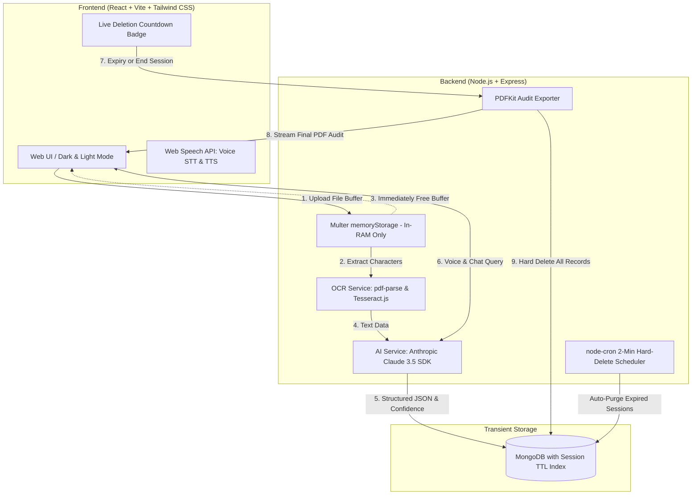

# Clause — Zero-Retention Intelligent Document Processing (IDP)

> **"Understand any document. Keep nothing."**

Clause is a production-quality, full-stack, privacy-first Intelligent Document Processing web application. Professionals across Finance, Legal, HR, Healthcare, Education, and Engineering can upload confidential documents, have AI classify them, extract structured JSON schemas, validate mathematical and domain integrity, and query cross-file insights through a customizable Jarvis-style voice & chat assistant.

Inspired by transient printing security models (like Blinkit Print), **Clause guarantees absolute zero retention**: files reside strictly in volatile RAM, memory buffers are expunged immediately after character extraction, and session records are hard-deleted automatically upon expiration or after generating your final PDF audit export.

---

## 1. Problem Statement
Professionals in every sector spend hours manually reading, sorting, and transcribing data from messy PDFs, scans, and documents. Existing IDP tools store confidential files permanently in cloud buckets, posing catastrophic data leak and compliance risks.

## 2. Solution Overview
Clause bridges high-accuracy document intelligence with zero-retention privacy:
1. **Volatile In-Memory Ingestion**: Files are processed in RAM without ever touching server disks.
2. **Multi-Industry AI Parsing**: Anthropic Claude AI categorizes documents, selects field schemas, extracts structured JSON, calculates confidence scores (0–100%), and flags risks.
3. **Jarvis Voice & Chat Assistant**: User-scoped cross-document Q&A with source citations, action execution, and Web Speech API voice support.
4. **Permanent Wipe & PDF Audit**: Delivers one clean PDF report containing all extractions and transcripts, then immediately hard-deletes everything.

---

## 3. Architecture Diagram



---

## 4. Tech Stack

- **Frontend**:
  - React.js with Vite
  - React Router
  - Tailwind CSS (Custom `#14B8A6` Teal & `#7C3AED` Violet theme, Glassmorphism, Dark/Light modes)
  - Axios (Auto-attaching JWT & Session headers)
  - Recharts (Interactive Donut, Bar, and Histogram charts)
  - lucide-react (Consistent iconography)
  - Web Speech API (Hands-free Voice Input & Spoken Replies)

- **Backend**:
  - Node.js & Express.js
  - JSON Web Tokens (JWT) & bcryptjs
  - Zod Request Validation
  - Multer (`memoryStorage` exclusively)
  - Passport.js (Google, GitHub, Facebook OAuth)
  - WhatsApp OTP Verification flow
  - Helmet, CORS, express-rate-limit
  - node-cron (Periodic hard-deletion daemon)

- **Database**:
  - MongoDB (Mongoose) with automatic TTL index on `expiresAt`

- **AI & Processing**:
  - Anthropic Claude API official SDK (`@anthropic-ai/sdk`)
  - `pdf-parse` for digital PDFs
  - `tesseract.js` for OCR on scans and images
  - `pdfkit` for final audit export compilation

---

## 5. Folder Structure

```
.
├── backend/
│   ├── .env.example
│   ├── .env
│   ├── package.json
│   ├── clause-api-collection.json
│   └── src/
│       ├── config/          # DB, Passport, and Schema seeds
│       ├── controllers/     # Auth, Session, Document, Chat, Search, Insights, Export
│       ├── middleware/      # JWT Auth, Session Check, Multer Memory, Zod, ErrorHandler
│       ├── models/          # User, Session (TTL), Document, ChatMessage, OTP
│       ├── routes/          # Express API route declarations
│       ├── services/        # Claude AI, OCR, PDFKit, and Cleanup Cron
│       └── server.js        # Express app entrypoint
├── frontend/
│   ├── index.html
│   ├── package.json
│   ├── vite.config.js
│   ├── tailwind.config.js
│   └── src/
│       ├── components/      # Common UI, Layout, Jarvis, Upload, Results
│       ├── context/         # Auth, Session (Countdown), Theme, Jarvis Contexts
│       ├── pages/           # Landing, Login, Onboarding, Upload, Results, Dashboard, Search, Chat, Settings, SessionEnd, Privacy
│       ├── services/        # Axios API, Sample Documents, Web Speech API
│       ├── App.jsx
│       └── main.jsx
└── sample_docs/             # Sample Invoice, Contract, and Resume for testing
```

---

## 6. Environment Variables

Create `.env` in `/backend`:

| Variable | Description | Default / Example |
|---|---|---|
| `PORT` | Backend server port | `5000` |
| `NODE_ENV` | Environment mode | `development` |
| `CLIENT_URL` | Frontend origin for CORS | `http://localhost:5173` |
| `MONGODB_URI` | MongoDB Connection String | `mongodb://127.0.0.1:27017/clause_db` |
| `JWT_SECRET` | Secret key for JWT signing | `clause_super_secure_jwt_secret_key_2026` |
| `JWT_EXPIRES_IN` | Token validity duration | `7d` |
| `SESSION_DEFAULT_TTL_MINUTES` | Default privacy session TTL | `15` |
| `ANTHROPIC_API_KEY` | Anthropic Claude API key | *(Optional: App includes fallback smart extractor for instant offline demo)* |
| `GOOGLE_CLIENT_ID` | Google OAuth Client ID | *(Optional)* |
| `GOOGLE_CLIENT_SECRET`| Google OAuth Client Secret | *(Optional)* |
| `GITHUB_CLIENT_ID` | GitHub OAuth App ID | *(Optional)* |
| `GITHUB_CLIENT_SECRET`| GitHub OAuth Secret | *(Optional)* |
| `FACEBOOK_APP_ID` | Facebook App ID | *(Optional)* |
| `FACEBOOK_APP_SECRET`| Facebook App Secret | *(Optional)* |

---

## 7. Setup & Run Locally

### Prerequisites
- Node.js (v18+) & npm
- MongoDB running locally or MongoDB Atlas connection URI

### 1. Backend Setup
```bash
cd backend
npm install
npm run dev
# Running on http://localhost:5000
```

### 2. Frontend Setup
```bash
cd frontend
npm install
npm run dev
# Running on http://localhost:5173
```

---

## 8. API Overview

- `POST /api/auth/register` — Register account with profession
- `POST /api/auth/login` — Sign in with JWT
- `POST /api/auth/whatsapp/request-otp` — Request 6-digit WhatsApp OTP
- `POST /api/auth/whatsapp/verify-otp` — Verify OTP and sign in
- `GET  /api/sessions/status` — Get active session countdown & memory stats
- `POST /api/sessions/extend` — Add +15 minutes to session TTL
- `POST /api/sessions/end` — Purge all session records immediately
- `POST /api/documents/upload` — In-memory multi-file upload, OCR & Claude extraction
- `GET  /api/documents` — List documents in active session
- `PUT  /api/documents/:id` — Update extracted fields (Human-in-the-loop review)
- `PATCH /api/documents/:id/status` — Mark Approved, Needs Review, or Rejected
- `GET  /api/search` — Keyword & metadata search across session records
- `GET  /api/insights/dashboard` — Recharts analytics & discovered anomalies
- `POST /api/chat/message` — Send query to Jarvis with source citations & actions
- `GET  /api/export?wipe=true` — Stream compiled PDF audit report & wipe server data

---

## 9. Demo Flow for Evaluators

1. **Landing Page**: Click **"Try 1-Click Interactive Demo"** on the hero banner.
2. **Onboarding**: Select **Finance & Accounting** and style Jarvis's personality.
3. **Upload**: Click **"Try Sample Documents"** -> Load **Apex Cloud Services Invoice** and **Master Services Agreement**.
4. **Results Review**: Inspect side-by-side text preview and structured JSON extractions. Try editing a field and clicking **"Approve Document"**.
5. **Ask Jarvis (Chat & Voice)**: Click the floating violet assistant button or microphone icon and ask:
   - *"What is my total spend across these invoices?"*
   - *"Show all unapproved documents."*
   - Notice the source citations and voice audio replies!
6. **Dashboard**: View the interactive Donut chart, status breakdown, and calculated highlights.
7. **End Session**: Click **"End Session"** in the top header. Click **"Download PDF & Permanently Shred Data"**. Watch the shredding animation dissolve your files and verify the zero-retention checklist!

---

## 10. License
MIT License • Built with privacy-first principles for the Build To Ship Hackathon.
